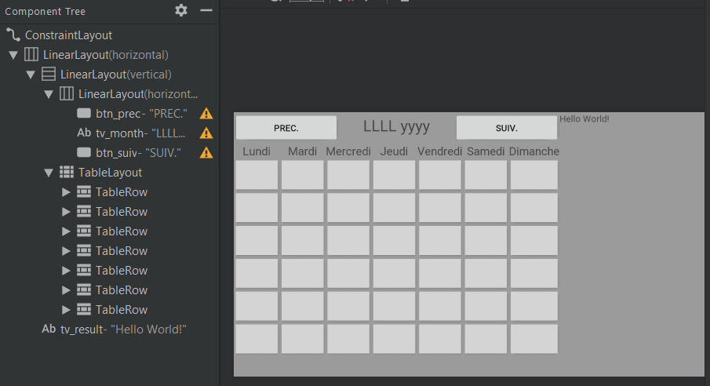
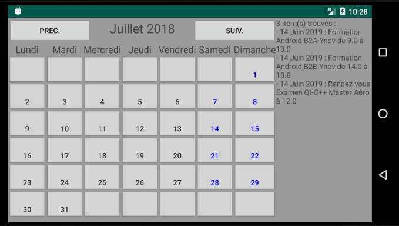

# Projet Final Android - Calendrier par Florian Lafuente

Dans ce repository, vous trouverez l'archive du projet, et ce rendu.

## Sommaire

- [Utilitaire MonCalendrier](#Utilitaire)
- [Dessin et Programmation du layout](#dessin)
- [Dao et XML](#xml)
  - [Modelisation des classes](#ModelisationClasses)
  - [Collection Calendrier avec récupération XML](#calendrier)
  - [Affichage des choses à faire](#choses)
- [Design Final](#design)

<a name="Utilitaire"></a>

## Utilitaire MonCalendrier

```java
public class MonCalendrier {
    public static String moisAnnee(int mois, int annee) {
        Calendar c = new GregorianCalendar(annee, mois - 1, 1);
        SimpleDateFormat sdf = new SimpleDateFormat("LLLL yyyy", new Locale("FR"));
        return sdf.format(c.getTime());
    }

    public static int premierJourMois(int mois, int annee) {
        Calendar c = new GregorianCalendar(annee, mois - 1, 1);
        int dayOfWeek = c.get(Calendar.DAY_OF_WEEK) - 2;
        // Si on est dimanche
        if (dayOfWeek == -1) {
            return 6;
        }
        return dayOfWeek;
    }

    public static int nombreJourMois(int mois, int annee) {
        Calendar c = new GregorianCalendar(annee, mois - 1, 1);
        return c.getActualMaximum(Calendar.DAY_OF_MONTH);
    }
}
```

- La méthode `moisAnnee` retourne le mois (en toutes lettres) et l'année. Cette méthode sera notamment utilisé pour afficher le mois courant de l'application.
- La méthode `premierJourMois` retourne le premier jour de la semaine du mois (lundi, mardi, ...) sous forme d'index (pour l'affiche en colonne dans le layout). Attention : le dimanche est le premier jour de la semaine dans la classe GregorianCalendar !
- La méthode `nombreJoursMois` retourne simplement le nombre de jour dans le mois choisi.


<a name="dessin"></a>

## Dessin et Programmation du layout

On créer l'apparence de notre application dans le fichier `activity_main.xml` de la façon suivante :



Il faut donner un id spécifique à chaque bouton selon sa ligne et sa colonne.


Ensuite, dans le `MainActivity.java` on va créer un tableau de boutons à deux dimensions et l'initialiser de la façon suivante : 

```java
// attributs du mainActivity
private Button[][] btn_jours = new Button[6][7];

...

// Dans la fonction onCreate
for (int l = 0; l < 6; l++) {
    for (int c = 0; c < 7; c++) {
        int res = getResources().getIdentifier("b_"+l+c,"id",getPackageName());
        btn_jours[l][c] = findViewById(res);
    }
}
```

Pour correctement afficher les jours du mois j'ai créer une fonction `setMonth` : 

<a name="isConge"></a>

```java
// attributs du mainActivity
private int month, year;

...
    
// fin de la méthode onCreate du mainActivity
Calendar c = Calendar.getInstance();
month = c.get(Calendar.MONTH) + 1;
year = c.get(Calendar.YEAR);
setMonth();

// Une méthode du mainActivity
public void setMonth() {
    tv_month.setText(MonCalendrier.moisAnnee(month, year));

    int i = 0;
    int jour = 1;
    for (int l = 0; l < 6; l++) {
        for (int c = 0; c < 7; c++) {
            btn_jours[l][c].setText("");
            if (i == MonCalendrier.premierJourMois(month, year) && jour <= MonCalendrier.nombreJourMois(month, year)) {
                btn_jours[l][c].setText(String.valueOf(jour));
                if (calendrier.getItems(new GregorianCalendar(year, month, jour)).size() >= 1) {
                    btn_jours[l][c].setTextColor(Color.parseColor("#ff0000"));
                } else if (calendrier.isConge(new GregorianCalendar(year, month, jour)) == true) {
                    btn_jours[l][c].setTextColor(Color.parseColor("#0000ff"));
                } else {
                    btn_jours[l][c].setTextColor(Color.parseColor("#2d2d2d"));
                }
                jour++;
            } else {
                i++;
            }
        }
    }
}
```

Le fonctionnement de la méthode `setMonth` est assez simple :

La variable `i` permet de trouver le premier jour du mois (lundi, mardi, ...) à l'aide de l'utilitaire `MonCalendrier`. La variable `jour` représente la date qu'on va écrire dans le bouton ciblé.

A l'aide d'une double boucle `for` j'incrémente `i` jusqu'à arriver sur le premier jour du mois (ensuite je ne touche plus à cette variable), à partir de ce moment j'assigne le texte du bouton actuel à la variable `jour` et j'incrémente `jour` jusqu'au dernier jour du mois (de la même façon on utilise l'utilitaire `MonCalendrier`).

> Note : au début de chaque itération je vide le texte du bouton pour éviter d'avoir des problèmes d'affichage à chaque changement de mois.

Ensuite, selon la date je change la couleur du texte (pour indiquer si il s'agit d'un congé ou si on à quelque chose de prévu).


On créer deux nouvelles méthodes `suivant` et `precedent` dans notre `MainActivity.java` qui seront assignés aux boutons "Suivant" et "Précédent" respectivement : 

```java
public void precedent(View view) {
    if (month - 1 > 0) {
        month = month - 1;
    } else {
        month = 12;
        year = year - 1;
    }

    setMonth();
}

public void suivant(View view) {
    if (month + 1 <= 12) {
        month = month + 1;
    } else {
        month = 1;
        year = year + 1;
    }

    setMonth();
}
```


<a name="xml"></a>

## Dao et XML

<a name="ModelisationClasses"></a>

### Modélisation des classes 

`ItemCalendrier.java`:

```java
public abstract class ItemCalendrier {
    public String type;
    public GregorianCalendar date;

    public ItemCalendrier(String type, GregorianCalendar date) {
        this.type = type;
        this.date = new GregorianCalendar(date.get(Calendar.YEAR), date.get(Calendar.MONTH), date.get(Calendar.DAY_OF_MONTH));
    }

    @Override
    public String toString() {
        String result = "- ";
        result += date.get(Calendar.DAY_OF_MONTH) + " " + MonCalendrier.moisAnnee(date.get(Calendar.MONTH), date.get(Calendar.YEAR)) + " : ";
        return result;
    }
}
```

`ItemConges.java`:

```java
public class ItemConges extends ItemCalendrier {

    public ItemConges (String type, GregorianCalendar date) {
        super(type, date);
    }
}
```

`ItemFormation.java`:

```java
public class ItemFormation extends ItemCalendrier {
    public float heureDebut;
    public float heureFin;
    public String libelle;

    public ItemFormation (String type, GregorianCalendar date, float heureDebut, float heureFin, String libelle) {
        super(type, date);
        this.heureDebut = heureDebut;
        this.heureFin = heureFin;
        this.libelle = libelle;
    }

    @Override
    public String toString() {
        String result = super.toString();
        result += type + " " + libelle + " de " + heureDebut + " à " + heureFin;
        return result;
    }
}
```

`ItemRendezVous.java`:

```java
public class ItemRendezVous extends ItemCalendrier{
    public float heureDebut;
    public String libelle;

    public ItemRendezVous (String type, GregorianCalendar date, float heureDebut, String libelle) {
        super(type, date);
        this.heureDebut = heureDebut;
        this.libelle = libelle;
    }

    @Override
    public String toString() {
        String result = super.toString();
        result += "Rendez-vous " + libelle + " à " + heureDebut;
        return result;
    }
}
```

Ces classes ne servent qu'à stocker les informations. On a ajouté une méthode `toString` pour l'affichage des différents éléments dans l'application.


<a name="calendrier"></a>

### Collection Calendrier avec récupération XML

`Calendrier.java`: 

```java
public class Calendrier extends ArrayList<ItemCalendrier> {

    public Calendrier(MainActivity mainActivity) {
        try {
            // Récupération du contenu du fichier XML
            InputStream is = mainActivity.getAssets().open("calendrier.xml");
            DocumentBuilderFactory dbf = DocumentBuilderFactory.newInstance();
            DocumentBuilder db = dbf.newDocumentBuilder();
            Document doc = db.parse(is);
            NodeList nlSeances = doc.getElementsByTagName("seance");

            // Création des items
            for (int i = 0; i< nlSeances.getLength(); i++) {
                Node nSeance = nlSeances.item(i);
                if (nSeance.getNodeType() == Node.ELEMENT_NODE) {
                    Element eSeance = (Element) nSeance;
                    String type = getValue("type", eSeance);
                    String[] split_date = getValue("date", eSeance).split("-");
                    GregorianCalendar date = new GregorianCalendar(Integer.valueOf(split_date[0]), Integer.valueOf(split_date[1]), Integer.valueOf(split_date[2]));
                    if (type.equals("Conge"))
                        this.add(new ItemConges(type, date));
                    else {
                        float heure_debut = Float.valueOf(getValue("heure_debut", eSeance));
                        String libelle = getValue("libelle", eSeance);
                        if (type.equals("RDV"))
                            this.add(new ItemRendezVous(type, date, heure_debut, libelle));
                        else {
                            float heure_fin = Float.valueOf(getValue("heure_fin", eSeance));
                            this.add(new ItemFormation(type, date, heure_debut, heure_fin, libelle));
                        }
                    }
                }
            }

        } catch (Exception e) {
            Log.e("XML Error", e.getMessage());
        }
    }

    public Calendrier () {

    }

    public ArrayList<ItemCalendrier> getItems(GregorianCalendar date) {
        ArrayList<ItemCalendrier> itemsOnDate = new ArrayList<ItemCalendrier>();
        for(ItemCalendrier item : this) {
            if (item.date.equals(date)) {
                if (!item.type.equals("Conge"))
                    itemsOnDate.add(item);
            }
        }

        return itemsOnDate;
    }

    public boolean isConge(GregorianCalendar date) {
        for(ItemCalendrier item : this) {
            if (item.date.equals(date)) {
                if (item.type.equals("Conge"))
                    return true;
            }
        }

        // Offset
        date.add(Calendar.MONTH, -1);
        int day = date.get(Calendar.DAY_OF_WEEK);
        if (day == 1 || day == 7)
            return true;

        return false;
    }

    private String getValue(String tag, Element elt) {
        NodeList nlist = elt.getElementsByTagName(tag).item(0).getChildNodes();
        Node node = nlist.item(0);
        return node.getNodeValue();
    }
}
```

Dans le premier constructeur on récupère le contenu du fichier XML. La méthode `isConge` permet de savoir si un congé est prévu à une date donnée (ou si la date donnée tombe un samedi ou un dimanche). La méthode `getItems` permet de savoir si quelque chose est prévu pour une date donnée (ou récupère ce qui est prévu).

> La méthode `getValue` est uniquement utilisé par récupérer les informations du XML.

Les méthodes `isConge` et `getItems` ont été vus [précédemment](#isConge), elles sont utilisées pour donner des couleurs aux différents jours du mois (`getItems` est aussi utilisé pour récupérer les actions de la journée et l'afficher dans le `TextView` de notre layout).


<a name="choses"></a>

### Affichage des choses à faire

Chaque bouton du calendrier possède un attribut `onClick` qui pointe vers la méthode suivante : 

```java
public void onDay(View view) {
    String day = ((Button)view).getText().toString();
    if (day.trim().isEmpty())
        return;

    ArrayList<ItemCalendrier> items = calendrier.getItems(new GregorianCalendar(year, month, Integer.valueOf(day)));
    tv_result.setText(String.valueOf(items.size()) + " item(s) trouvés : ");
    for (ItemCalendrier item : items) {
        tv_result.setText(tv_result.getText() + "\n" + item.toString());
    }
}
```

Au clic, on affiche le nombre d'items trouvés. Si on trouve au moins un item, on affiche tout les items dans notre `TextView` à l'aide de la fonction `toString` de nos items (vu [précédemment](#ModelisationClasses)).


<a name="design"></a>

## Design Final




